# JetSparkle

**This repository contains exploratory individual advanced android jetpack components which can be used as a reference for main stream projects**

## Tech stack
- Kotlin, Jetpack Compose, Dagger Hilt, Retrofit, Gradle

## Features
- Paging jetpack component used to list latest news from news response in on-demand fashion.
- Work manager components used to trigger notification for the application
- Download manager to download a file from internet into local device.
- Exoplayer component to play a video from a hosted url
- Individual user interface components animated on its different properties

## Screens
- **News article list screen with paging implementation**

  

- **App notification screen using work manager**

  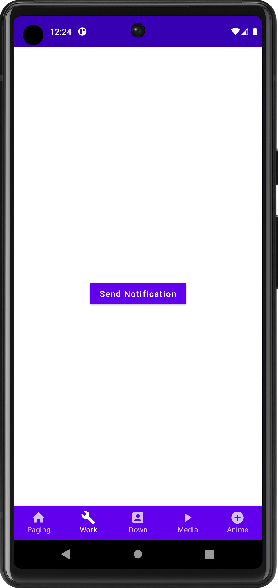
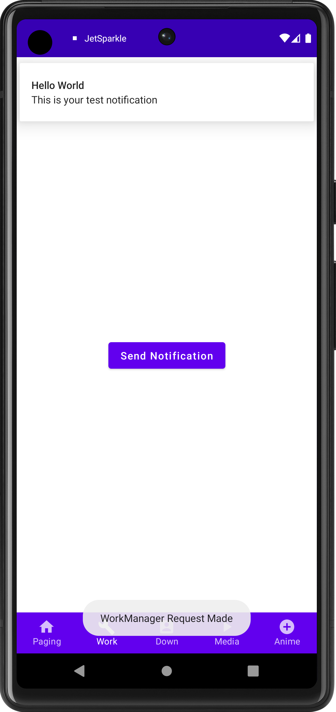

- **File download screen using download manager**

  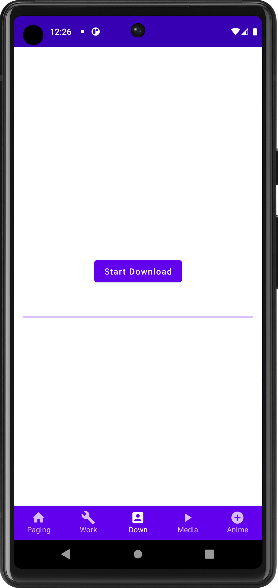
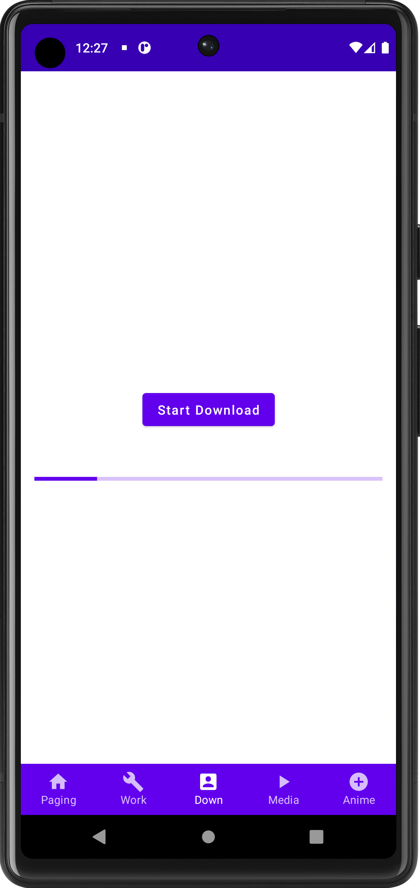
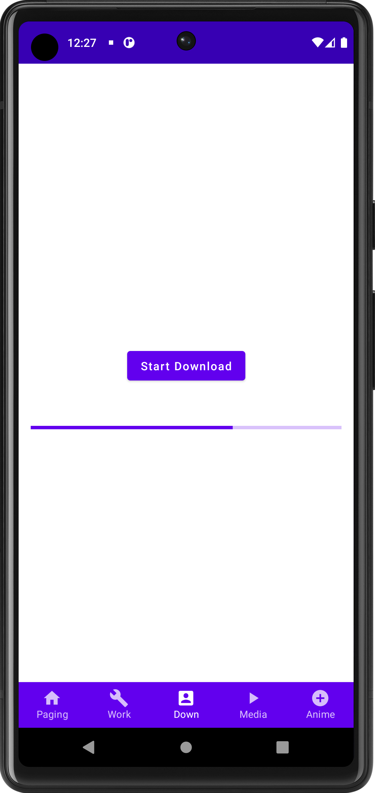
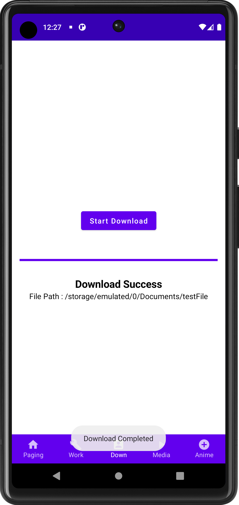

- **Video player screen using download manager**

  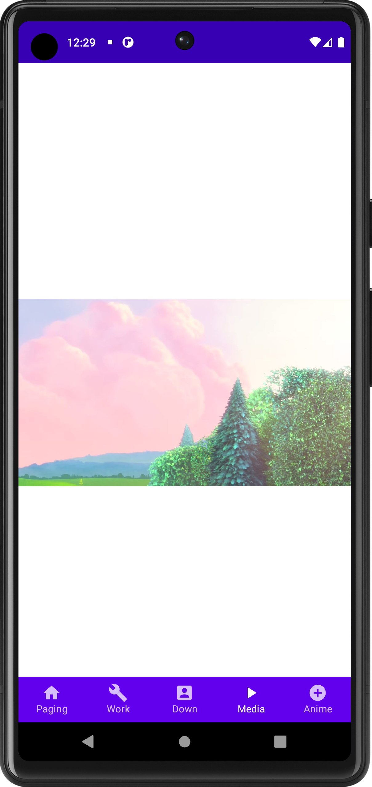
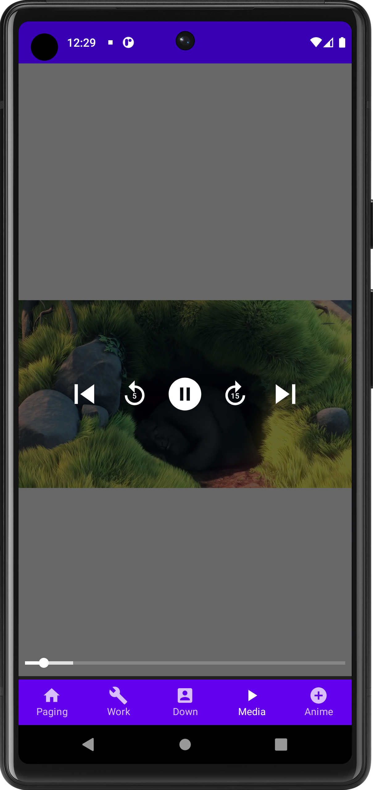
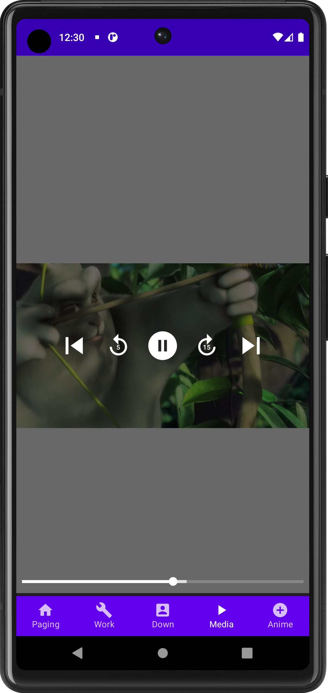

- **Animation components screen**

  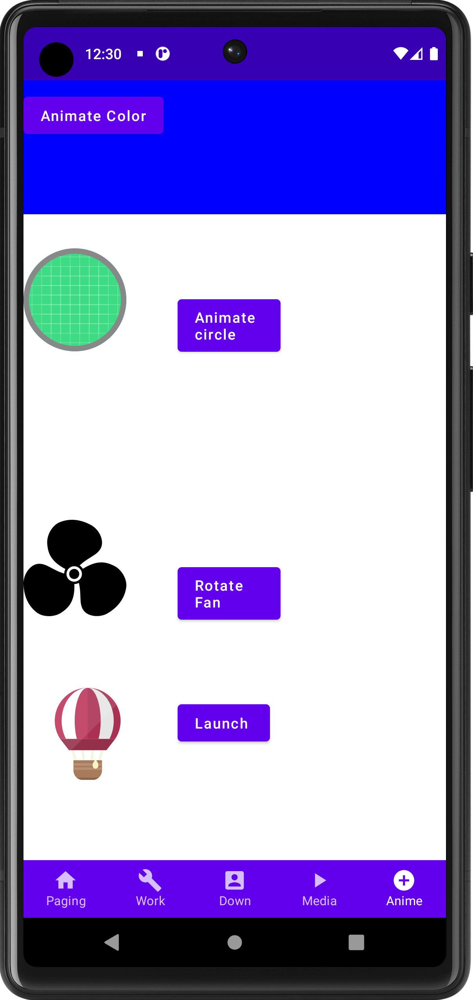
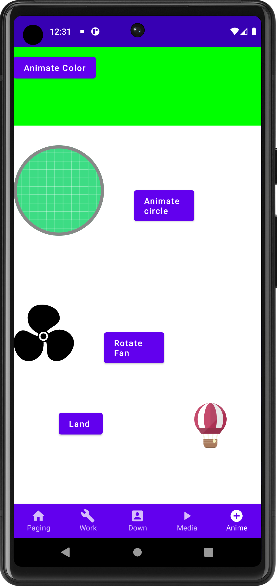

